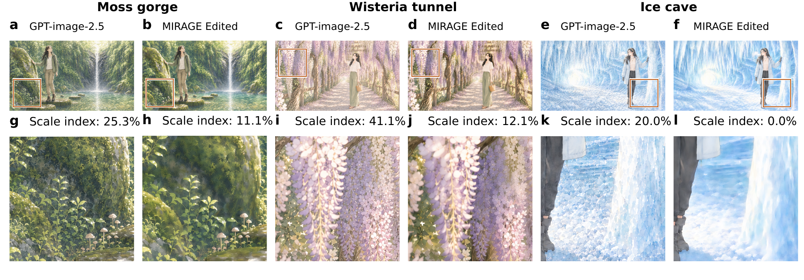
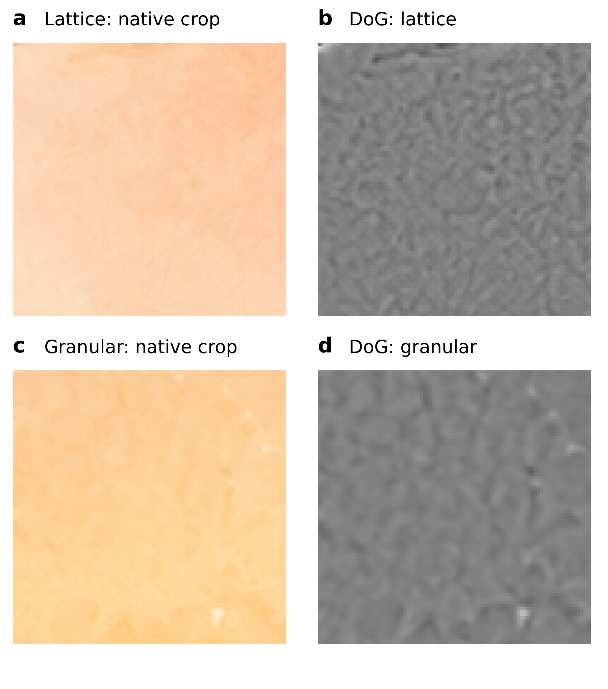
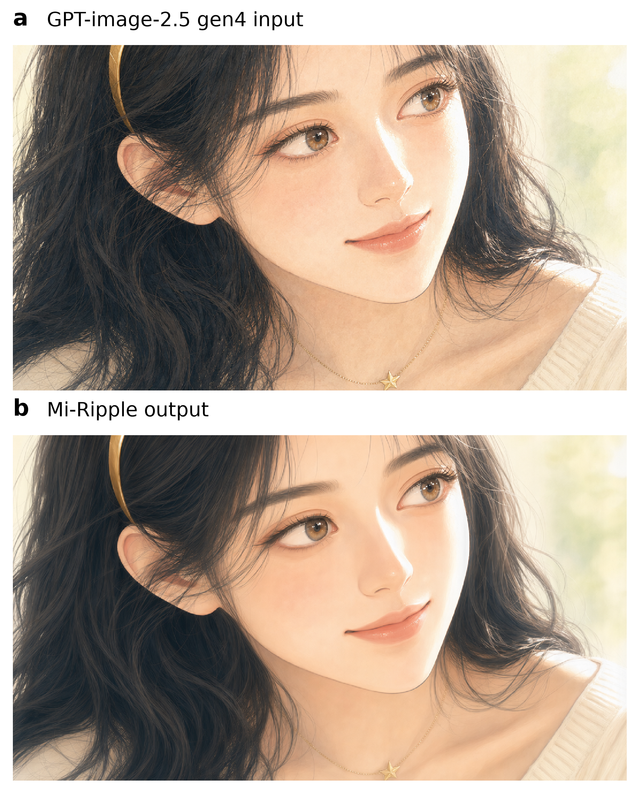
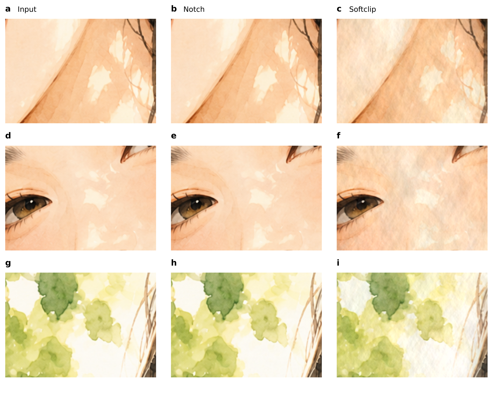
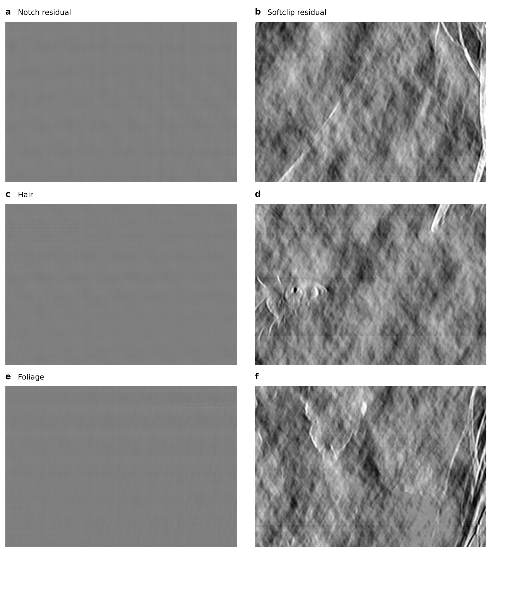

# MIRAGE

Reference implementation of **MIRAGE**, MIYANG's diagnosis-guided workflow for
restoring grid-like and scale-like artifacts introduced by iterative,
reference-conditioned AI image editing.

[Try MIRAGE on the MIYANG Lab website →](https://lab.miyang.cn/ripple/)

MIRAGE does not apply one aggressive filter to every image. It first separates:

- **Periodic lattice artifacts**: isolated spectral peaks that can be selectively
  notched with low measured distortion.
- **Granular artifacts in unstructured regions**: 3–8 px texture that can be
  reduced behind a structure-protection mask.
- **Content-entangled artifacts**: repeated texture overlapping hair, foliage,
  fabric, or other legitimate detail. These require human review or optional
  regeneration from a cleaned reference.

> [!IMPORTANT]
> This is a research implementation, not a universal artifact detector. Automatic
> scores are triage signals. Review the generated heat maps and comparison boards
> before accepting an output.

## Before / after

This is the same Image 2.5 night-hair comparison used by the
[MIYANG Lab tool](https://lab.miyang.cn/ripple/). Open the original files to
inspect the hair texture at native resolution.

| Before | After |
| --- | --- |
| [](assets/comparison/night-hair-before.jpg) | [](assets/comparison/night-hair-after.jpg) |

The images share the same source composition but come from separate experimental
branches: direct regeneration versus cleaned-reference regeneration followed by
selective lattice notching. Regeneration is not pixel-aligned restoration and can
change fine semantic details.

## Installation

Python 3.11 or newer is required.

```bash
git clone https://github.com/miyang-ai/mirage.git
cd mirage
python -m venv .venv
source .venv/bin/activate
pip install -e .
```

OpenCV-based face protection is optional:

```bash
pip install -e ".[face]"
```

For development:

```bash
pip install -e ".[dev]"
pytest
```

## Quick start

Local deterministic processing is the default:

```bash
mirage input.png output/
```

The output directory contains:

- a diagnosis JSON and visual inspection boards;
- intermediate masks and processed candidates;
- a machine-readable XML decision trace;
- a final image when the deterministic route can deliver one;
- a sidecar containing hashes, parameters, measurements, and the final outcome.

If artifacts overlap image content, the default route stops with
`needs_human_decision`. Optional regeneration requires explicit permission and a
MIYANG API key:

```bash
export MIYANG_API_KEY=...
mirage input.png output/ --allow-regen --max-regen 1
```

Regeneration may change image content, dimensions, and color. Its output remains
a candidate until a person accepts it.

## Python API

```python
from pathlib import Path

from mirage.pipeline import run

result = run(Path("input.png"), Path("output"))
print(result["outcome"], result["final"])
```

Individual measurement and processing modules are also public:

- `mirage.diagnosis`
- `mirage.scale_index`
- `mirage.notch`
- `mirage.spatial`
- `mirage.reference`
- `mirage.verify`

## Method and evidence

The accompanying paper is:

> Yicheng Xu, Jiayin Chen, and Muting Wang. **MIRAGE: Restoring Images
> Degraded by Iterative AI Editing.** MIYANG Technology (Shanghai) Co., Ltd.,
> 2026.

The [LaTeX manuscript](paper/manuscript.tex), [references](paper/references.bib),
and publication figures are included in [`paper/`](paper/).

### Paper figures



| Artifact forms | Targeted restoration |
| --- | --- |
| [](paper/figures/ripple_forms_en.pdf) | [](paper/figures/restoration_en.pdf) |

#### Selective notch versus broad spectral suppression

[](paper/figures/notch_comparison_en.pdf)

[](paper/figures/notch_residuals_en.pdf)

See [docs/ALGORITHM.md](docs/ALGORITHM.md) for the decision flow and
[docs/LIMITATIONS.md](docs/LIMITATIONS.md) before interpreting reported scores.
Provider integration and billing boundaries are documented in
[docs/REGENERATION.md](docs/REGENERATION.md).
The publication-ready manuscript will be linked here when its permanent public
record is available.

The test suite uses synthetic deterministic inputs. The documented comparison and
paper figures are curated publication assets; private user images and internal
production archives are not included.

## Agent Skill

This repository includes an Agent Skills-compatible workflow at
[`skills/mirage/SKILL.md`](skills/mirage/SKILL.md). It teaches an AI coding agent
to install the package, process a user-provided image, inspect the generated
boards, request permission before regeneration, and return the actual result.

Install the `mirage` skill with an Agent Skills-compatible client by pointing it
at:

```text
https://github.com/miyang-ai/mirage
```

The skill never authorizes paid regeneration on the user's behalf.

## Contributors

See [CONTRIBUTORS.md](CONTRIBUTORS.md).

## Brand and license

The source code is released under the [MIT License](LICENSE).

MIYANG, its logo, and associated product branding are trademarks or brand assets
of MIYANG Technology (Shanghai) Co., Ltd. The MIT License does not grant rights
to use those marks. See [TRADEMARKS.md](TRADEMARKS.md).

Copyright © 2026 MIYANG Technology (Shanghai) Co., Ltd.
